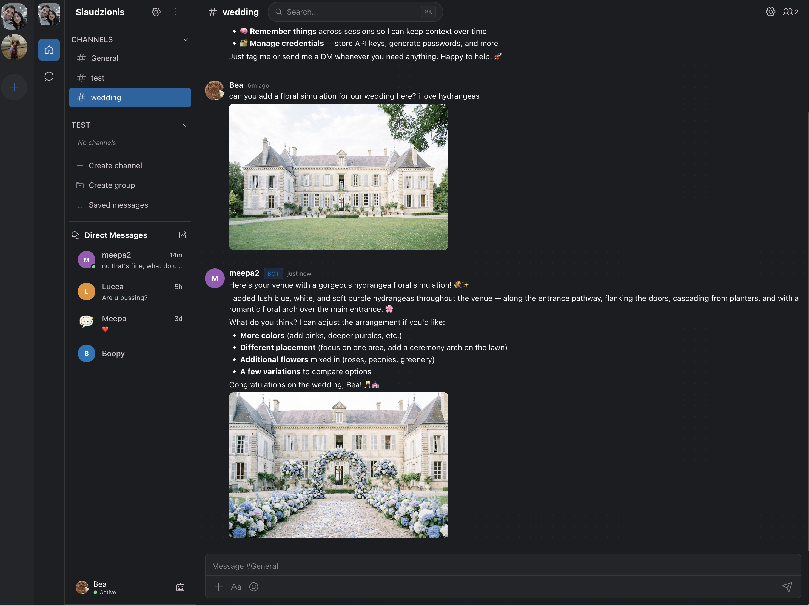
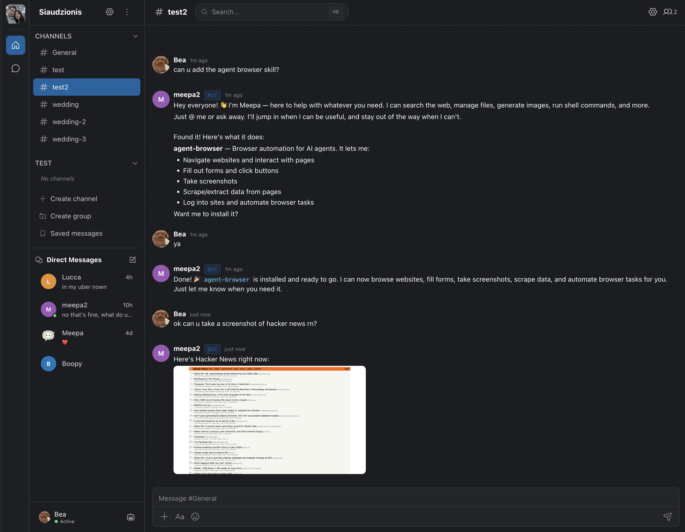

<p align="center">
    
    <br><br>
    <b>Multi-platform AI bot gateway.</b><br>
    Connect AI agents to <a href="https://github.com/bogpad/meepachat">MeepaChat</a>, Discord, Telegram, Slack, and WhatsApp.
    <br><br>
    <a href="https://github.com/bogpad/meepagateway/releases"></a>
    <a href="https://github.com/bogpad/meepagateway"></a>
    <br><br>
    
</p>

---

## What is MeepaGateway?

MeepaGateway is the **brain and soul of your bot**. You give it a personality, connect it to an AI model (like Claude or GPT), and it handles everything else: thinking, responding, remembering context.

It's also a **bridge**. One bot can live in Discord, Slack, [MeepaChat](https://github.com/bogpad/meepachat), Telegram, and WhatsApp at the same time, from a single config file. No need to build separate integrations for each platform.

**In short:** you define *who* your bot is, MeepaGateway figures out *how* to run it everywhere.

---

## Install

```bash
curl -fsSL https://meepa.ai/install-meepagateway.sh | sh
```

Or via Homebrew:

```bash
brew install bogpad/tap/meepagateway
```

## Quick start

```bash
meepagateway
```

On first run, you'll choose a setup method:

- **`[1]` Terminal wizard**: interactive step-by-step in your terminal
- **`[2]` Web dashboard**: Captain Dashboard at `http://localhost:8092`

Both walk you through configuring your LLM provider, creating an agent, and connecting to a chat platform. To re-run later: `meepagateway setup`

## Showcase

### Agent generating wedding floral simulations (with image generation)



### Installing a skill from the catalogue via chat



## Deploy to a server

### DigitalOcean (recommended)

One command. Auto-detects SSH keys, prints your dashboard URL and setup code when done:

```bash
bash <(curl -fsSL https://meepa.ai/deploy-do-meepagateway.sh)
```

Skip the setup wizard entirely by passing your API key and password:

```bash
bash <(curl -fsSL https://meepa.ai/deploy-do-meepagateway.sh) \
  --anthropic-key "sk-ant-..." \
  --password "your-password"
```

The script automatically uses a **pre-baked snapshot** if one exists in your account (~30 second boot), otherwise falls back to **cloud-init** on a fresh Ubuntu image (~3 minute install).

> Need doctl? `brew install doctl && doctl auth init`

### Any VPS (Hetzner, Linode, Vultr, AWS, GCP, Azure, etc.)

Use cloud-init. Paste as "User data" when creating a server:

```bash
curl -sfL https://meepa.ai/cloud-init-meepagateway.sh
```

After boot (~3 minutes), open `http://<server-ip>:8092`.

Environment variables you can set before running cloud-init:

| Variable | Description |
|-|-|
| `ANTHROPIC_API_KEY` | Anthropic API key for Claude models |
| `OPENAI_API_KEY` | OpenAI API key (optional) |
| `MEEPAGATEWAY_PASSWORD` | Dashboard password (skip setup wizard) |
| `TAILSCALE_AUTH_KEY` | Tailscale auth key for private HTTPS (optional) |

### Manual install

On any Ubuntu server:

```bash
curl -fsSL https://meepa.ai/install-meepagateway.sh | sh
meepagateway
```

## Updating

Re-run the install script:

```bash
curl -fsSL https://meepa.ai/install-meepagateway.sh | sh
```

Or update via the Captain Dashboard (Settings > Update) | `meepagateway update` | `brew upgrade meepagateway`

## Manage your agents

MeepaGateway ships with two interfaces:

**Captain Dashboard** is a web UI for managing agents, connectors, providers, credentials, skills, and cron jobs. Runs at `http://localhost:8092` by default.

<p align="center">
    
</p>

**CLI** for everything you'd want from a terminal:

```bash
meepagateway status          # Show running agents
meepagateway logs             # Tail agent activity
meepagateway agent list       # List agents
meepagateway agent soul edit  # Edit an agent's personality
meepagateway update           # Self-update
```

## Sandboxing strategies

MeepaGateway has three layers of isolation for agent shell commands, from strongest to lightest:

### Container mode

Runs each agent inside a Docker container, isolating the entire agent loop (LLM calls, tool execution, shell commands) from the host. A fresh container is spawned per message and destroyed after the response is sent.

Containers run with a read-only rootfs, all capabilities dropped, no privilege escalation, and a memory cap. The only writable paths are the agent workspace and `/tmp`. API keys are passed via stdin and never written to disk.

You can configure which packages are available inside the container (python3, nodejs, git, etc.) through the Captain Dashboard or `config.yaml`. See the [full sandbox docs](https://meepa.mintlify.app/gateway/sandbox) for setup details.

### Kernel isolation (default)

When container mode is off, shell commands are automatically sandboxed using OS-level kernel isolation:

- **macOS**: [Seatbelt](https://reverse.put.as/wp-content/uploads/2011/09/Apple-Sandbox-Guide-v1.0.pdf) (`sandbox-exec`) — profile-based sandbox that restricts file access, network, and process operations
- **Linux**: [Landlock](https://landlock.io/) LSM (kernel 5.13+) — directory-level read/write allowlisting

### Unrestricted mode

Skip kernel isolation entirely. Shell commands run without any sandbox. Three ways to enable it:

- **CLI flag**: `meepagateway start --unrestricted` — applies to all agents for that session (not persisted)
- **Per-agent config**: set `file_access.unrestricted: true` in `config.yaml`
- **Dashboard**: toggle "Unrestricted File Access" in the agent settings

Use this only for trusted agents that need full system access (e.g., a dev-ops agent managing your server). Most agents should use the default kernel isolation.

### Choosing a strategy

| Strategy | Isolation | Performance | Use case |
|-|-|-|-|
| Container mode | Full OS-level (Docker) | Slower (container spin-up per message) | Untrusted code, public-facing agents |
| Kernel isolation | File/network restrictions | Native speed | Default for all agents |
| Unrestricted | None | Native speed | Trusted agents needing full access |

## Why MeepaGateway?

Most bot frameworks give you a basic request-response loop. I wanted something that could fully leverage what [MeepaChat](https://github.com/bogpad/meepachat) exposes: rich markdown responses, group chats where multiple agents can collaborate, persistent memory, and dynamic skills. And I wanted the same agents to work across Discord, Slack, Telegram, and WhatsApp without rewriting anything.

I also personally like having a CLI and dashboard for managing my bots. `meepagateway logs` to tail agent activity, a built-in credential store so API keys aren't scattered in env vars, and a web UI to configure everything visually. I wanted something that feels like a tool, not just a library.

MeepaGateway is completely independent of MeepaChat. You don't need one to use the other. There are plenty of great bot frameworks out there, and MeepaChat works with any of them. MeepaGateway is just the one I built because I wanted something that fit the way I think about agents.

Define your agents once (their personality, memory, skills, and MCP tools) and run them everywhere from a single process.

I'm building this solo, so if you run into bugs or have ideas, [open an issue](https://github.com/bogpad/meepagateway/issues). I'd love to hear how you're using it.

## Documentation

- [Full docs](https://meepa.mintlify.app/gateway/introduction)
- [MeepaChat](https://github.com/bogpad/meepachat): the team chat app that MeepaGateway connects to
